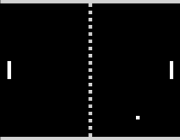

# PONG

Полноэкранная копия классического PONG 1972 года для Windows 11.
Два игрока, геймпады Logitech F310, звук как в оригинальном автомате.



## Запуск

Двойной клик по **`PONG.bat`** — и всё. При первом запуске он сам доставит
`pygame-ce`, если её нет.

Из терминала то же самое:

```
python pong.py
```

## Управление

| Действие | Геймпад | Клавиатура |
|---|---|---|
| Ракетка вверх/вниз | левый стик или крестовина | Игрок 1: `W` / `S`, Игрок 2: `↑` / `↓` |
| Начать / подать / играть ещё раз | `START`, `A` или `B` | `Пробел` или `Enter` |
| Один игрок против компьютера | — | `1` |
| Два игрока | — | `2` |
| Пауза | — | `P` |
| Вернуться в меню | — | `R` |
| Окно / полный экран | — | `F11` или `Alt+Enter` |
| Выход | — | `Esc` |

Первый подключённый геймпад — левая ракетка, второй — правая.
Геймпады можно втыкать и вынимать прямо во время игры, игра их подхватит.

## Про Logitech F310

На нижней стороне геймпада есть переключатель **X / D**:

* **X** (XInput) — рекомендуемый режим, работает сразу;
* **D** (DirectInput) — тоже работает, игра читает левый стик и крестовину в обоих режимах.

Вибрации у F310 нет физически — код её запрашивает, но геймпад её просто игнорирует
(на F710 вибрация заработает).

Если ракетка «уезжает» сама — у стика великоват дрейф, увеличьте `DEADZONE`
в начале `pong.py` (0.22 → 0.30).

## Правила

Игра до **11 очков**. Мяч ускоряется с каждым отбитием — чем ближе к краю ракетки
вы его принимаете, тем острее угол. Классика: игра идёт на пас, а не на силу.

## Настройка под себя

Все параметры — в начале `pong.py`:

| Константа | Что делает |
|---|---|
| `WIN_SCORE` | до скольких очков играем |
| `PADDLE_H` | высота ракетки (больше = легче) |
| `PADDLE_SPEED` | скорость ракетки |
| `BALL_SPEED_START` / `BALL_SPEED_MAX` | начальная и максимальная скорость мяча |
| `BALL_SPEED_STEP` | насколько мяч ускоряется за удар |
| `DEADZONE` | мёртвая зона стика |

## Требования

Python 3.14 и `pygame-ce` (у обычной `pygame` пока нет сборки под 3.14 — ставится
именно `pygame-ce`, импортируется всё равно как `pygame`).
